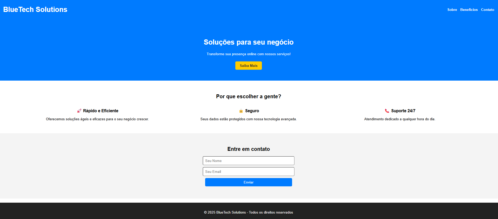

# Landing Page - BlueTech Solutions

[](https://www.timeanddate.com/date/)


## Descrição

Esta é uma landing page para a empresa **BlueTech Solutions**, projetada para apresentar os serviços e benefícios da empresa. A página inclui uma navegação intuitiva, seção de benefícios, formulário de contato e design responsivo.

## Tecnologias Utilizadas

A landing page foi construída utilizando as seguintes tecnologias:

[](https://developer.mozilla.org/en-US/docs/Web/HTML) [](https://developer.mozilla.org/en-US/docs/Web/CSS) [](https://developer.mozilla.org/en-US/docs/Web/JavaScript)  




## Estrutura do Projeto

- **Cabeçalho**: Um menu de navegação com links para as seções "Sobre", "Benefícios" e "Contato".
- **Seção Hero**: Apresentação de uma mensagem chamativa sobre as soluções oferecidas pela BlueTech Solutions.
- **Benefícios**: Uma seção destacando três principais benefícios dos serviços da empresa:
    - 🚀 Rápido e Eficiente
    - 🔒 Seguro
    - 📞 Suporte 24/7
- **Formulário de Contato**: Permite que os visitantes enviem seu nome e email para entrar em contato.
- **Rodapé**: Um rodapé com a marca registrada da BlueTech Solutions.

   <br><br>

# 🖥️ Testando a Aplicação

É possível usar dados mockados para teste ou fazer uso do banco de dados MySQL. 


### 📌 Passos para Testar com Dados Mockados

- Clone esse repositório. Acesse o terminal do VsCode digite o comando:

  ```
  git clone https://github.com/LaylaJHB/services.git
  ```
  
- Instale as dependências
  ```
  npm install
  ```
- Inicie o servidor Node.js
  ```
  npm start
  ```

- Abra a Landing Page (lp.html) 
  - Clique com o botão direito do mouse sobre o arquivo `landingPage.html` e clique na opção ```Open with Live Server```

<br>
    
  - >✨ Caso não apareça a opção "Open with Live Server", instale a extensão Live Server (https://marketplace.visualstudio.com/items?itemName=ritwickdey.LiveServer)
  <br>

  
  <br>

- Preencha o formulário de contato presente na landingPage

- Visualize os leads cadastrados:

  
  > - Acesse no navegador: http://localhost:3000/leads

<br>
O sistema armazenará os leads (nome e e-mail) enviados pelo formulário.
<br><br>


🎥 [Assista ao vídeo da demonstração


<video width="600" controls>
  <source src="https://raw.githubusercontent.com/LaylaJHB/services/main/2025-01-30%2019-13-34.mp4" type="video/mp4">
  Seu navegador não suporta vídeos.
</video>


## 🛠️ Criando o Banco de Dados MySQL

- Acesse o MySQL
- Acesse sua conexão, por exemplo: "MySQL Connections"
- crie o banco de dados e a tabela para armazenar os leads:
  
<br>

 Ⓜ️ Comando SQL (Execute no MySQL)

1. Crie o banco de dados

```
    CREATE DATABASE landingpage_db;
```
<br>  

2. Acesse o banco de dados criado

```
    USE landingpage_db;
```
<br>

3. Crie a tabela para receber os leads
```
    CREATE TABLE leads (
        id INT AUTO_INCREMENT PRIMARY KEY,
        nome VARCHAR(100) NOT NULL,
        email VARCHAR(100) NOT NULL UNIQUE
    );
```
<br>

## Licença

Este projeto é licenciado sob a [Licença MIT](LICENSE).

